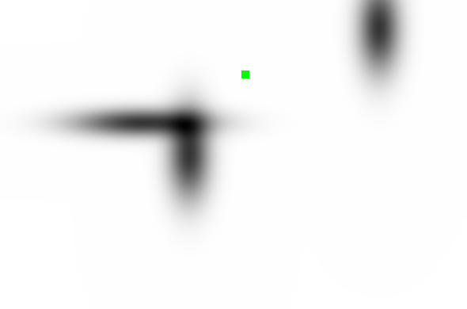

# gym-puddle
Puddle world environment for OpenAI Gym with continuous state space and discrete action space.

<kbd>
  
</kbd>

## Installation
Run this line in the project directory.

`pip3 install -e .`

## Usage
```python
import gym
import gym_puddle # Don't forget this extra line!

env = gym.make('PuddleWorld-v0')
```

##  Notes
Rendering is available. The program runs much faster without it, but it's good for debugging.

Run this line after each time step to see the puddles and agent location.
```python
env.render()
```

## References

Off-Policy Actor-Critic. Thomas Degris, Martha White, Richard S. Sutton. In *Proceedings of the Twenty-Ninth International Conference on Machine Learning (ICML)*, 2012.

http://rlpark.github.io/ (Java implementation)

https://github.com/samindaa/RLLib (C++ implementation)
